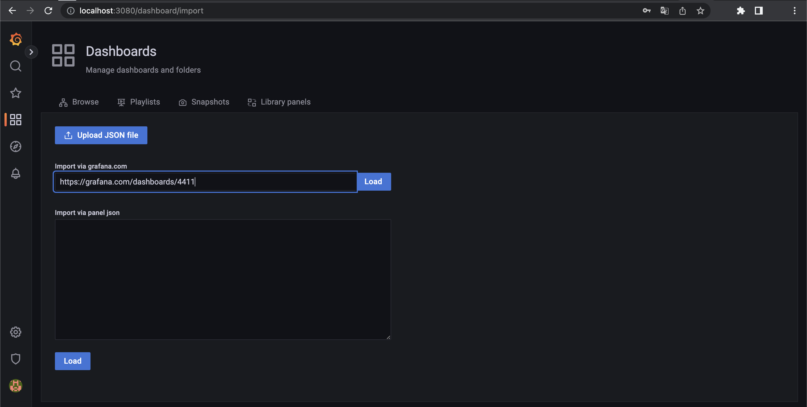

# Using k6, InfluxDB and Grafana to perform and monitor stress testing in Kubernetes


This article is aimed to describe the whole process of performing 
stress testing using k6 in Kubernetes cluster:
1. Installing and configuring environment.
2. Performing stress testing.
3. Monitoring and analyzing of testing results.

All manifests, which are used in the article, can be found by the following link:

https://github.com/Zorgont/2022_2023-introduction_to_distributed_technologies-k4111c-plakhotniuk_v_a/blob/main/article/article.md

## Table of content
1. Overview
2. Install required tools
3. Write a k6 test
4. Prepare a cluster for stress testing
5. Perform testing
6. References

## Overview

k6 is a modern load-testing tool, built on our years of experience in the performance and testing industries.
This tool is created by [Grafana Labs](https://grafana.com).
It's built to be powerful, extensible, and full-featured. The key design goal is to provide the best developer experience.
Despite JMeter, k6 is more suitable for developers, because tests can be written using JavaScript. 
Moreover, k6 transforms JavaScript code with test scenario into Golang, so k6 much more performable, than JMeter.

K6 tests can be easily scaled not only increasing a number of Virtual Users, but running them within Kubernetes cluster.
Using Kubernetes for this reason has a few more pros:
- You run tests within cluster, which provides more security and removes the need for exposing your software outside.
- You run tests in the same way as all your other infrastructure components.

Probably the main disadvantage of k6 is a lack of UI with testing results. However, Grafana labs provides the ability to easily
integrate k6 with metrics storages, such as Influx and Prometheus. Furthermore, you can go beyond and set up Grafana
Dashboard to visualise stored metrics.

So that in the article will be described installation of Kubernetes cluster (using Minikube),
configuring of k6, InfluxDB and Grafana Dashboards within cluster and executing of stress testing.
It should be mentioned, that application, which is going to be tested, will be deployed in the same cluster as k6.

## Install required tools

To make it all work macOS platform was used. I assume, that steps for Linux will be the same, but you can face
some problems in case of Windows (in particular, during installation of k6-operator).
So I would recommend using either Linux or macOS. You need to make sure, that `make` utility is working on your machine. 

First, it is required to install Docker. I installed [Docker Desktop](https://docs.docker.com/desktop/install/mac-install), 
because it ships docker and virtualization tools for macOS. Note: if you already have configured Kubernetes cluster,
you can skip this step.

Second, you need to install the [latest version Golang](https://go.dev/doc/install) (for example, 1.19.3).

Third, you should install [Kubectl](https://kubernetes.io/docs/tasks/tools/install-kubectl-macos).

Fourth, [Helm](https://helm.sh/docs/intro/install) should be installed.

Fifth, it is necessary to install [Minikube](https://kubernetes.io/ru/docs/tasks/tools/install-minikube/) on your local machine. Note: if you already have configured Kubernetes cluster,
you can skip this step.

Finally, it is time to start your Kubernetes cluster. As it was mentioned above, if you don't have one, you can start
Minikube cluster using the following command:

```
minikube start --driver=docker
```

After a few minutes, your cluster will be configured and ready for k6!

## Write a k6 test

For the presentation reason, a simple k6 test was written:

```javascript
import http from 'k6/http';
import { check } from 'k6';

export let options = {
    stages: [
        { target: 300, duration: '5s' },
        { target: 500, duration: '120s' },
        { target: 0, duration: '30s' },
    ],
};

export default function () {
    const result = http.get('http://app-service:9090');
    check(result, {
        'http response status code is 200': result.status === 200,
    });
}
```

This test sends get requests to the application. The URL of the application is provided by service manifest (as it was 
mentioned above, application is deployed in the same cluster; k8s manifest of the application can be found in GitHub).

Also, there are a few options for the test - number of VUs (Virtual Users). So test starts with 0 VU, 
then during first 5 seconds, this number will be increased up to 300. After 2 minutes, number of VUs will be equals 500.
Finally, during last 30 seconds number of VUs will be decreased to 0.
To get more information about k6 tests you can visit [official documentation](https://k6.io/docs).

During test performing, k6 will store lots of metrics to the metric source. By default, k6 simply store them inside and
after the end of testing show statistic as it present below: 


But we will use Influx for this purpose.

## Prepare a cluster for stress testing

In this part we will prepare cluster for testing.

### Deploy the application to cluster
It is necessary to deploy the application to the cluster. A sample of such application is present in 
the GitHub repository. To deploy the application the following command is used:

```
kubectl apply -f article/manifests/app.yaml
```

This file has 3 manifests: Deployment, Service and ConfigMap.
Service name is `app-service`, port is `9090`.

Using port-forward it is possible to access the application:

```
kubectl port-forward service/app-service 9090:9090
```


### Install Influx

As a metric storage InfluxDB will be used. Influx can be easily deployed in the k8s cluster using Helm:

```
helm repo add influxdata https://helm.influxdata.com
helm upgrade --install influxdb \
--set persistence.enabled=true,persistence.size=5Gi \
  --set "env[0].name=INFLUXDB_DB" \
  --set "env[0].value=k6" influxdata/influxdb
```

Inside the cluster, Influx will be available by the following address:

```
http://influxdb:8086
```

### Install Grafana

Grafana also can be deployed in the cluster using Helm:

```
helm repo add grafana https://grafana.github.io/helm-charts
helm repo update
helm install grafana grafana/grafana
```

After Grafana installation it is required to obtain password for admin:

```
kubectl get secret grafana -o jsonpath="{.data.admin-password}" | base64 --decode ; echo
```

This password will be used to access Grafana Dashboard.

The next step is to port-forward Grafana and access UI:

```
kubectl port-forward service/grafana 3080:80
```

After authentication, the main page will be opened:


For now, two things are interested us:
1. Configuration of data source as Influx.
2. Downloading default dashboards for k6.

After clicking on `Add your first data source` we will be able to configure Influx as a data source:


In the database field it is required to specify `k6`:


When data source is configured, it is necessary to set up default dashboards. K6 has one, you can get them from 
[official site](https://grafana.com/grafana/dashboards/10660-k6-load-testing-results).

Installation of dashboards is pretty simple - you should paste url to dashboards:



### Install k6

First, you should install `k6-operator` for k8s. It is a Kubernetes operator for running distributed k6 tests 
in a cluster.

To install `k6-operator` it is necessary to clone repository and execute make command:

```
git clone https://github.com/grafana/k6-operator && cd k6-operator
make deploy
```

Then it is required to put JavaScript representation of test to k8s configmap:

```
kubectl create configmap k6-sample-stress-test --from-file k6-operator/e2e/test.js
```

After that, k6 manifest can be configured:

```
apiVersion: k6.io/v1alpha1
kind: K6
metadata:
  name: k6-sample
spec:
  parallelism: 4
  script:
    configMap:
      name: "k6-sample-stress-test"
      file: "test.js"
  arguments: --out influxdb=http://influxdb:8086/k6
```

Note, that this manifest has K6 kind, which is supplied into the cluster by k6-operator.
Also in the manifest name of configmap and filename with script is present. Parallelism configures how many k6 test 
runner jobs the operator should spawn. Moreover, you must specify output of k6 test in case of external metric storage.

At this point we have configured the cluster, so all is set to perform stress testing! 

## Perform testing

To run k6 test you can simply type:

```
kubectl apply -f k6-operator/e2e/test.yaml
```

If we open Grafana Dashboards, we can see visualization of test metrics:


As you can see, there are lots of default metrics. Moreover, you can define your own and add them to Grafana. But this
is a little out of scope of the article.

## References

- https://qainsights.com/performance-tools-benchmarking/
- https://k6.io/blog/running-distributed-tests-on-k8s/
- https://k6.io/docs/results-output/real-time/
- https://kubernetes.io/docs/concepts/extend-kubernetes/operator/
- https://www.useanvil.com/blog/engineering/persisting-load-test-data-with-k6/
- https://engineering.empathy.co/distributed-load-testing-with-k6/