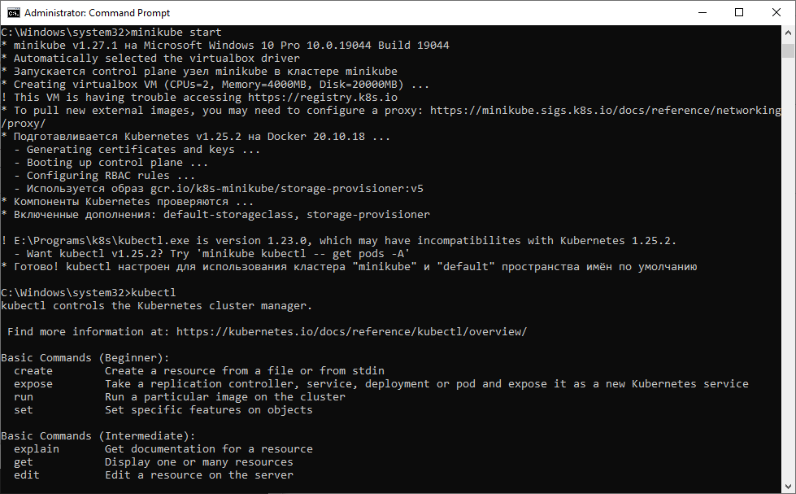
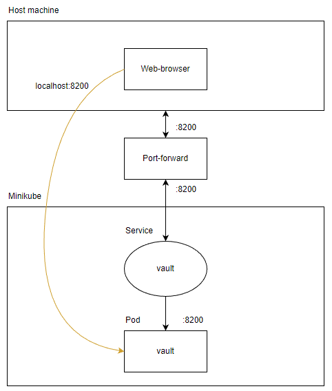

University: [ITMO University](https://itmo.ru/ru/)

Faculty: [FICT](https://fict.itmo.ru)

Course: [Introduction to distributed technologies](https://github.com/itmo-ict-faculty/introduction-to-distributed-technologies)

Year: 2022/2023

Group: K4111c

Author: Plakhotniuk Vladlen Aleksandrovich

Lab: Lab1

Date of create: 22.10.2022

Date of finished: TBD

# Progress of work
## 1. Minikube installation
First, it was necessary to install **minikube** on the machine.
The following instruction was used to do that: 
https://minikube.sigs.k8s.io/docs/start/

As a result it was possible to execute **minikube** command in CMD:


## 2. Creation of a k8s cluster
After installation of minikube it was necessary to create k8s cluster.
It can be made simply using command **minikube start**:



Then it was checked, that kubectl is installed on the machine, so 
there is no need to use **minikube kubectl** command.

## 3. Preparing a k8s manifest for vault
As required in the lab, **vault** should be deployed on the k8s cluster.
It is also said, that only pod manifest should be written, so the following
code block presents it:

```yaml
apiVersion: v1
kind: Pod
metadata:
  name: vault
  labels:
    app: vault
spec:
  containers:
    - name: vault
      image: vault:latest
      ports:
        - name: web
          containerPort: 8200
          protocol: TCP
```

## 4. Creating a k8s pod, service and usage of port-forward
When manifest is written, it can be applied for the cluster using command **kubectl apply -f <file>**.
Then information about created resources can be found (e.g. **kubectl get pods**).
After that, service was created in order to user port-forward to get inside of the **vault**:


Accessing vault:


To get a token it is necessary to research logs of the vault container:
```
C:\Users\zorgo>kubectl logs vault
Couldn't start vault with IPC_LOCK. Disabling IPC_LOCK, please use --cap-add IPC_LOCK
==> Vault server configuration:

             Api Address: http://0.0.0.0:8200
                     Cgo: disabled
         Cluster Address: https://0.0.0.0:8201
              Go Version: go1.19.1
              Listener 1: tcp (addr: "0.0.0.0:8200", cluster address: "0.0.0.0:8201", max_request_duration: "1m30s", max_request_size: "33554432", tls: "disabled")
               Log Level: info
                   Mlock: supported: true, enabled: false
           Recovery Mode: false
                 Storage: inmem
                 Version: Vault v1.12.0, built 2022-10-10T18:14:33Z
             Version Sha: 558abfa75702b5dab4c98e86b802fb9aef43b0eb

==> Vault server started! Log data will stream in below:

2022-10-21T23:21:43.470Z [INFO]  proxy environment: http_proxy="" https_proxy="" no_proxy=""
2022-10-21T23:21:43.470Z [WARN]  no `api_addr` value specified in config or in VAULT_API_ADDR; falling back to detection if possible, but this value should be manually set
2022-10-21T23:21:43.471Z [INFO]  core: Initializing version history cache for core
2022-10-21T23:21:43.471Z [INFO]  core: security barrier not initialized
2022-10-21T23:21:43.471Z [INFO]  core: security barrier initialized: stored=1 shares=1 threshold=1
2022-10-21T23:21:43.472Z [INFO]  core: post-unseal setup starting
2022-10-21T23:21:43.484Z [INFO]  core: loaded wrapping token key
2022-10-21T23:21:43.484Z [INFO]  core: Recorded vault version: vault version=1.12.0 upgrade time="2022-10-21 23:21:43.48438443 +0000 UTC" build date=2022-10-10T18:14:33Z
2022-10-21T23:21:43.484Z [INFO]  core: successfully setup plugin catalog: plugin-directory=""
2022-10-21T23:21:43.484Z [INFO]  core: no mounts; adding default mount table
2022-10-21T23:21:43.485Z [INFO]  core: successfully mounted backend: type=cubbyhole path=cubbyhole/
2022-10-21T23:21:43.485Z [INFO]  core: successfully mounted backend: type=system path=sys/
2022-10-21T23:21:43.485Z [INFO]  core: successfully mounted backend: type=identity path=identity/
2022-10-21T23:21:43.486Z [INFO]  core: successfully enabled credential backend: type=token path=token/ namespace="ID: root. Path: "
2022-10-21T23:21:43.487Z [INFO]  core: restoring leases
2022-10-21T23:21:43.487Z [INFO]  rollback: starting rollback manager
2022-10-21T23:21:43.487Z [INFO]  expiration: lease restore complete
2022-10-21T23:21:43.487Z [INFO]  identity: entities restored
2022-10-21T23:21:43.487Z [INFO]  identity: groups restored
2022-10-21T23:21:43.919Z [INFO]  core: post-unseal setup complete
2022-10-21T23:21:43.920Z [INFO]  core: root token generated
2022-10-21T23:21:43.920Z [INFO]  core: pre-seal teardown starting
2022-10-21T23:21:43.920Z [INFO]  rollback: stopping rollback manager
2022-10-21T23:21:43.920Z [INFO]  core: pre-seal teardown complete
2022-10-21T23:21:43.920Z [INFO]  core.cluster-listener.tcp: starting listener: listener_address=0.0.0.0:8201
2022-10-21T23:21:43.920Z [INFO]  core.cluster-listener: serving cluster requests: cluster_listen_address=[::]:8201
2022-10-21T23:21:43.920Z [INFO]  core: post-unseal setup starting
2022-10-21T23:21:43.920Z [INFO]  core: loaded wrapping token key
2022-10-21T23:21:43.920Z [INFO]  core: successfully setup plugin catalog: plugin-directory=""
2022-10-21T23:21:43.920Z [INFO]  core: successfully mounted backend: type=system path=sys/
2022-10-21T23:21:43.920Z [INFO]  core: successfully mounted backend: type=identity path=identity/
2022-10-21T23:21:43.920Z [INFO]  core: successfully mounted backend: type=cubbyhole path=cubbyhole/
2022-10-21T23:21:43.921Z [INFO]  core: successfully enabled credential backend: type=token path=token/ namespace="ID: root. Path: "
2022-10-21T23:21:43.922Z [INFO]  core: restoring leases
2022-10-21T23:21:43.922Z [INFO]  rollback: starting rollback manager
2022-10-21T23:21:43.922Z [INFO]  expiration: lease restore complete
2022-10-21T23:21:43.922Z [INFO]  identity: entities restored
2022-10-21T23:21:43.922Z [INFO]  identity: groups restored
2022-10-21T23:21:43.922Z [INFO]  core: post-unseal setup complete
2022-10-21T23:21:43.922Z [INFO]  core: vault is unsealed
2022-10-21T23:21:43.927Z [INFO]  core: successful mount: namespace="" path=secret/ type=kv
2022-10-21T23:21:43.928Z [INFO]  secrets.kv.kv_4c8f7ce8: collecting keys to upgrade
2022-10-21T23:21:43.928Z [INFO]  secrets.kv.kv_4c8f7ce8: done collecting keys: num_keys=1
2022-10-21T23:21:43.928Z [INFO]  secrets.kv.kv_4c8f7ce8: upgrading keys finished
WARNING! dev mode is enabled! In this mode, Vault runs entirely in-memory
and starts unsealed with a single unseal key. The root token is already
authenticated to the CLI, so you can immediately begin using Vault.

You may need to set the following environment variables:

    $ export VAULT_ADDR='http://0.0.0.0:8200'

The unseal key and root token are displayed below in case you want to
seal/unseal the Vault or re-authenticate.

Unseal Key: YnDLygjzCgwMvgcuyudrLuI411JDWworOqObt2C/iT4=
Root Token: hvs.5U6yAyP9N7UyzCRyt8NmoFyC

Development mode should NOT be used in production installations!
```

At the bottom of the log **Root Token** can be found. This token will be used to access vault in the future:


## 5. Overall architecture
The picture below describes entities, which are used in the current lab work.

