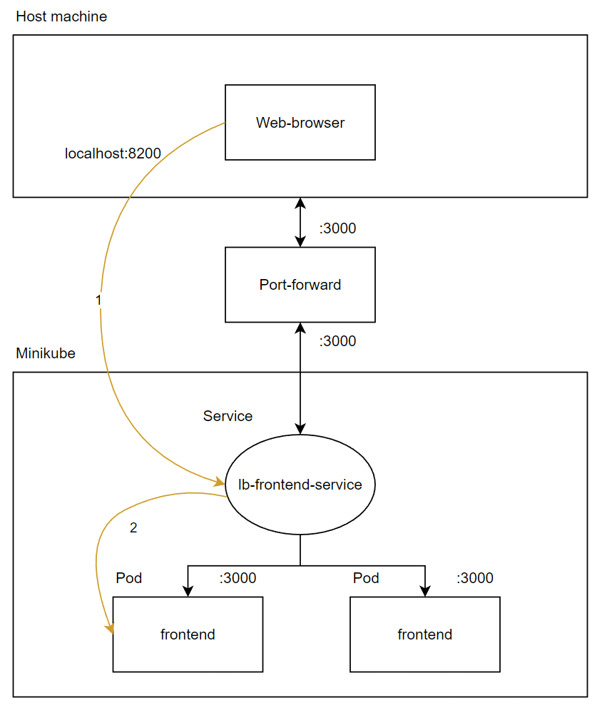

University: [ITMO University](https://itmo.ru/ru/)

Faculty: [FICT](https://fict.itmo.ru)

Course: [Introduction to distributed technologies](https://github.com/itmo-ict-faculty/introduction-to-distributed-technologies)

Year: 2022/2023

Group: K4111c

Author: Plakhotniuk Vladlen Aleksandrovich

Lab: Lab2

Date of create: 23.10.2022

Date of finished: TBD

# Progress of work
## 1. Preparing a deployment manifest
First, it was necessary to create deployment manifest.
The requirements are present below:
* container - **ifilyaninitmo/itdt-contained-frontend:master**
* container port - **3000**
* replicas number - **2**
* environment variables should be set:
    * REACT_APP_USERNAME
    * REACT_APP_COMPANY_NAME
    
Using the requirements above the deeployment manifest was created:
```yaml
apiVersion: apps/v1
kind: Deployment
metadata:
  name: frontend
  labels:
    app: frontend
spec:
  replicas: 2
  selector:
    matchLabels:
      app: frontend
  template:
    metadata:
      labels:
        app: frontend
    spec:
      containers:
      - name: frontend
        image: ifilyaninitmo/itdt-contained-frontend:master
        ports:
        - containerPort: 3000
        env:
        - name: REACT_APP_USERNAME
          value: Vladlen
        - name: REACT_APP_COMPANY_NAME
          value: ITMO
```

## 2. Applying the manifest
To apply the manifest it is necessary to use the following command:
```
kubectl apply -f <file>
```
So the manifest was applied:


Also, some information was printed, such as info about deployment and pods.

## 3. Exposing deployment
After applying, deployment was exposed and port-forwarding was used to reach container from the host machine:


It was decided to use **LoadBalancer** service type. As a result, the following page was opened:


After refreshing nothing changed. It seems that there is not enough load of a pod, 
so load balancer decides not to forward requests to another pod.

Logs of pods are also the same:
```
Builing frontend
build finished
Server started on port 3000
```

## 4. Overall architecture
The picture below describes entities, which are used in the current lab work.

