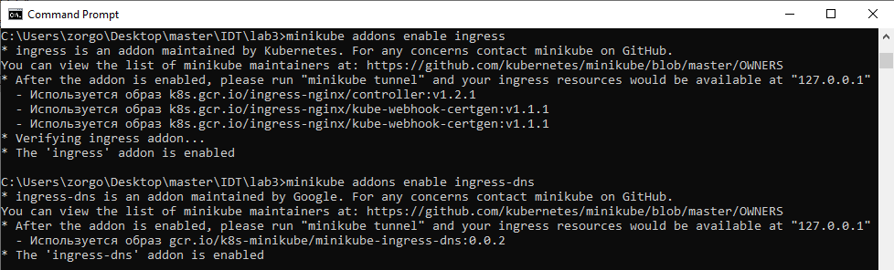
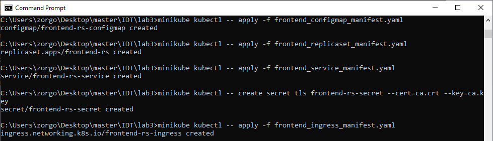
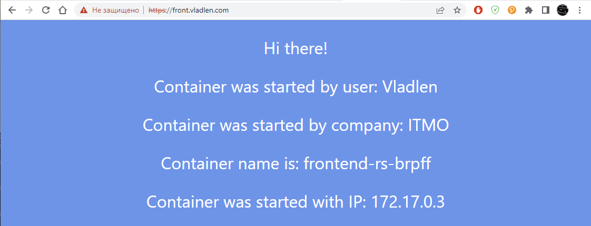
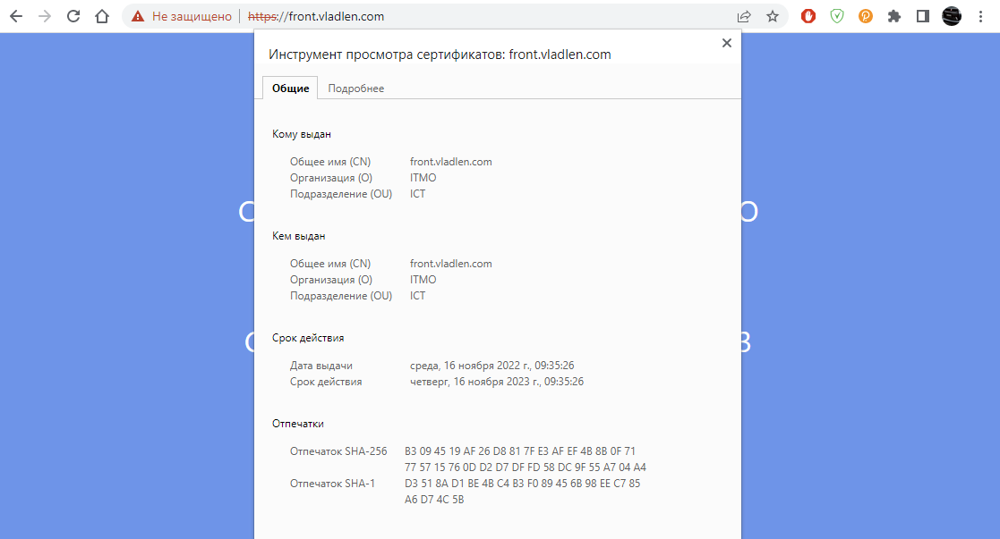
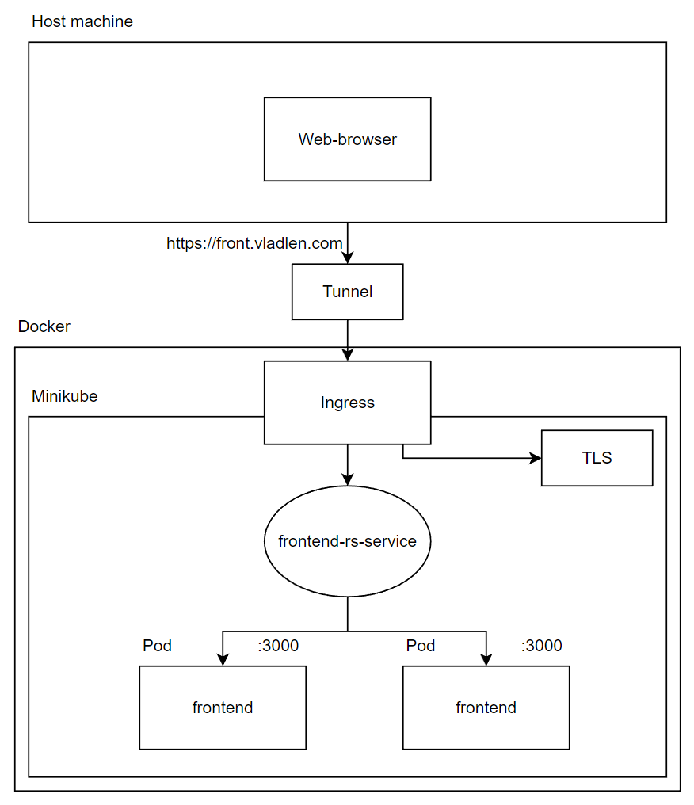

University: [ITMO University](https://itmo.ru/ru/)

Faculty: [FICT](https://fict.itmo.ru)

Course: [Introduction to distributed technologies](https://github.com/itmo-ict-faculty/introduction-to-distributed-technologies)

Year: 2022/2023

Group: K4111c

Author: Plakhotniuk Vladlen Aleksandrovich

Lab: Lab2

Date of create: 13.11.2022

Date of finished: TBD

# Progress of work
## 1. Preparing manifests
First, it was necessary to create a configMap manifest, that contains the following set of variables:
```yaml
apiVersion: v1
kind: ConfigMap
metadata:
  name: frontend-rs-configmap
data:
  username: "Vladlen"
  company: "ITMO"
```

Second, it was necessary to create a ReplicaSet manifest.
The requirements are present below:
* container - **ifilyaninitmo/itdt-contained-frontend:master**
* container port - **3000**
* replicas number - **2**
* environment variables from ConfigMap should be used
    
Using the requirements above the ReplicaSet manifest was created:
```yaml
apiVersion: apps/v1
kind: ReplicaSet
metadata:
  name: frontend-rs
  labels:
    app: lab3
spec:
  replicas: 2
  selector:
    matchLabels:
      app: lab3
  template:
    metadata:
      labels:
        app: lab3
    spec:
      containers:
        - name: frontend-rs-pod
          image: ifilyaninitmo/itdt-contained-frontend:master
          env:
            - name: REACT_APP_USERNAME
              valueFrom:
                configMapKeyRef:
                  name: frontend-rs-configmap
                  key: username
            - name: REACT_APP_COMPANY_NAME
              valueFrom:
                configMapKeyRef:
                  name: frontend-rs-configmap
                  key: company
          ports:
            - containerPort: 3000
```

Third, it was necessary to create service to expose pods:
```yaml
apiVersion: v1
kind: Service
metadata:
  name: frontend-rs-service
spec:
  selector:
    app: lab3
  ports:
    - protocol: TCP
      port: 9090
      targetPort: 3000
  type: NodePort
```

Fourth, it was necessary to create ingress:
```yaml
apiVersion: networking.k8s.io/v1
kind: Ingress
metadata:
  name: frontend-rs-ingress
  annotations:
    nginx.ingress.kubernetes.io/rewrite-target: /
spec:
  tls:
    - secretName: frontend-rs-secret
      hosts:
        - front.vladlen.com
  rules:
    - host: front.vladlen.com
      http:
        paths:
          - pathType: Prefix
            path: /
            backend:
              service:
                name: frontend-rs-service
                port:
                  number: 9090
```

## 2. Creating tls certificate
To create TLS certificate the following commands were used:
```
openssl genrsa -out ca.key -2048
openssl req -x509 -newkey rsa:4096 -sha256 -nodes -keyout ca.key -out ca.crt
```

## 3. Configuring minikube and environment
Because of using Docker as a minikube driver, it was necessary to add a few addons for minikube:
```
minikube addons enable ingress
minikube addons enable ingress-dns
```



Also, file **hosts** should be edited like it present below:
```
127.0.0.1 front.vladlen.com
```

When ingress created, it will be necessary to execute the following command:
```
minikube tunnel
```

## 4. Applying manifests
Applying manifests (+ creating TLS secret):



## 5. Accessing application
To access an application it was necessary to go to the following link:
```
https://front.vladlen.com
```



Certificate information:



## 6. Overall architecture
The picture below describes entities, which are used in the current lab work.

