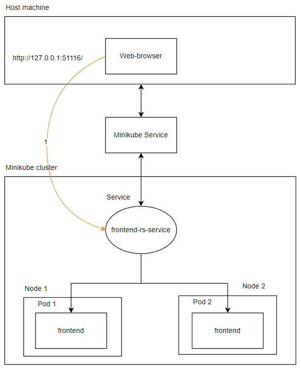

University: [ITMO University](https://itmo.ru/ru/)

Faculty: [FICT](https://fict.itmo.ru)

Course: [Introduction to distributed technologies](https://github.com/itmo-ict-faculty/introduction-to-distributed-technologies)

Year: 2022/2023

Group: K4111c

Author: Plakhotniuk Vladlen Aleksandrovich

Lab: Lab2

Date of create: 13.11.2022

Date of finished: TBD

# Progress of work
## 1. Creating minikube cluster
First, minikube cluster with 2 nodes using calico:
```
minikube start --nodes 2 --cni calico --kubernetes-version=v1.24.3
```

After that it was checked, that all two nodes were successfully created and works normal:


Second, it was necessary to create calicoctl pod to use it. 
Manifest used in the command was received from official website of calico.


## 2. Creating IP-Pools and replica set
First, it was necessary to create ip-pools.
```yaml
apiVersion: projectcalico.org/v3
kind: IPPool
metadata:
  name: zone-west-ippool
spec:
  cidr: 192.168.0.0/24
  ipipMode: Always
  natOutgoing: true
  nodeSelector: zone == "west"
---
apiVersion: projectcalico.org/v3
kind: IPPool
metadata:
  name: zone-east-ippool
spec:
  cidr: 192.168.1.0/24
  ipipMode: Always
  natOutgoing: true
  nodeSelector: zone == "east"
```
This example also was taken from official website.
To apply the manifest the following command was executed:
```
kubectl exec -i -n kube-system calicoctl -- /calicoctl create -f - < ip_pool.yaml
```


However, there was a default ip-pool:


So that it was decided to remove it:


At the end, manifest with configmap, replica set and service was applied:


## 3. Accessing the application

First, it was necessary to execute the following command to expose service:
```
minikube service frontend-rs-service
```

After that in the browser new page was opened:


Also, after refreshing of a page another information is shown (name and IP of container):


## 4. Ping containers

At the end it was checked, that pods can ping each other:


## 5. Overall architecture
The picture below describes entities, which are used in the current lab work.

